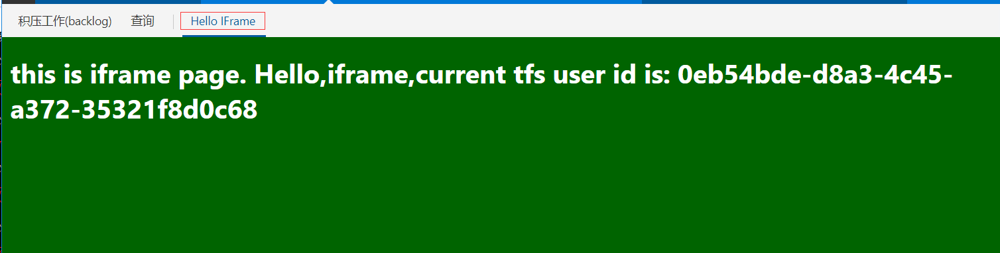
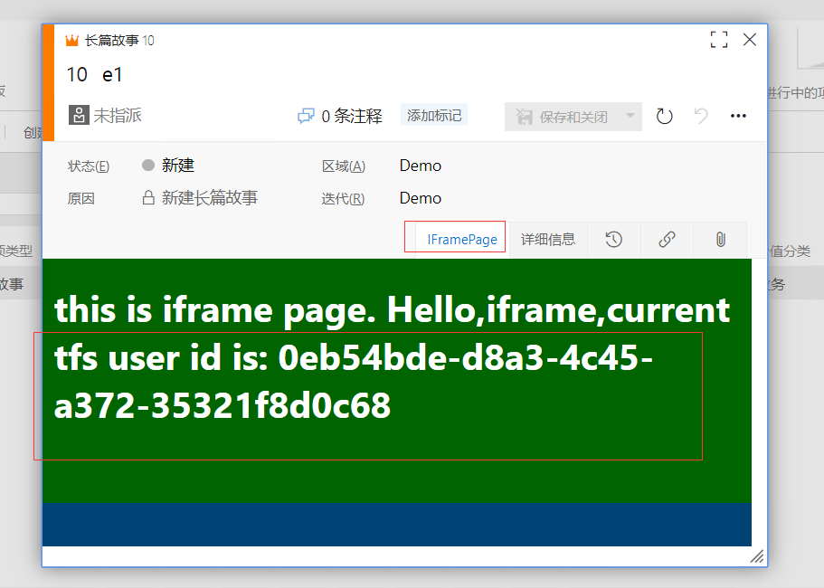

# tfs 扩展 显示 IFrame 页面示例

## 编译&&打包

- 修改workitem-hub.html页面中的ifrme src地址
- npm install
- npm run build


## 目录

- iframe-demo 插件示例

- child-pages

index.html: 插件页面iframe 中加载的页面，将此页面部署至WebServer，并更新上面的iframe src


## 扩展点

TFS 工作下添加了一个Tab页面



TFS 工作项编辑表单处添加Tab页面




## 参考资料

https://docs.microsoft.com/en-us/azure/devops/extend/develop/configure-workitemform-extensions?view=tfs-2018
https://docs.microsoft.com/en-us/azure/devops/extend/develop/add-workitem-extension?view=tfs-2018#addapage
https://marketplace.visualstudio.com/items?itemName=ms-samples.samples-contributions-guide&ssr=false&referrer=https%3A%2F%2Fapp.vssps.visualstudio.com%2F#overview

## 在工作项表单页添加扩展

需更新工作项模板

- 插件安装好后，获取模板，模板文件有插件ID，必须 通过此方式获取扩展ID

通过以下命令获取模板：

`witadmin exportwitd /collection:http://win-j4ounpm2mvi:8080/tfs/DefaultCollection2 /p:Demo /n:长篇故事 /f:E:\\work\\witadmin\\Epic.xml`

在模板中找到这部分注释，然后添加  <Extensions> 节点

```
扩展:
	名称: tfs-ext-iframe-demo
	ID: lena-soft.tfs-ext-iframe-demo

	页贡献:
		ID: lena-soft.tfs-ext-iframe-demo.iframe.demo-form-tab-hub
		说明: Custom work item form page

注意: 有关工作项扩展的详细信息，请参阅以下主题:
http://go.microsoft.com/fwlink/?LinkId=816513
-->
        <Extensions>
            <Extension Id="lena-soft.tfs-ext-iframe-demo" />
        </Extensions>
```

在weblayout中添加以下内容：

`<PageContribution Label="IFramePage" Id="lena-soft.tfs-ext-iframe-demo.iframe.demo-form-tab-hub" />`

- 修改好后导入模板即可

`witadmin importwitd /collection:http://win-j4ounpm2mvi:8080/tfs/DefaultCollection2 /p:Demo /f:E:\\work\\witadmin\\Epic.xml`


